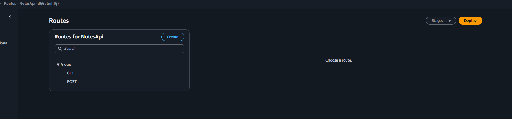
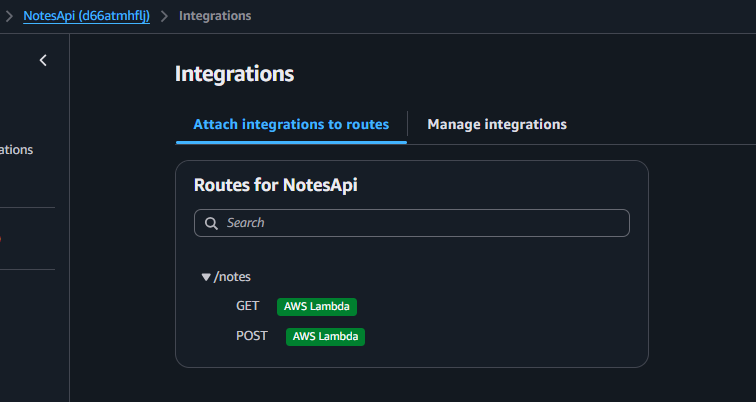
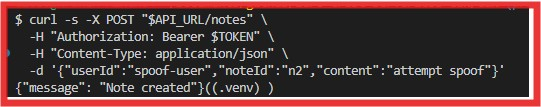
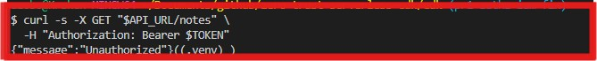

#  Zero-Trust Serverless Notes API (CDK + Cognito + Lambda + DynamoDB)
A secure, fully serverless Notes API built using AWS CDK (Python), Cognito, Lambda, API Gateway, and DynamoDB. Designed using Zero Trust principles and least-privilege access to showcase modern authentication and infrastructure-as-code (IaC) patterns.

--- 

## 📌 Project Features
-  **Zero Trust Authentication** using Amazon Cognito and JWT validation
-  **Serverless** architecture with AWS Lambda and API Gateway (HTTP API v2)
-  **Scoped IAM** (PR1): Lambda has DynamoDB read/write to support GET(Query) + POST(PutItem); **PR4 splits functions for strict least privilege per route.**
-  **DynamoDB**: Notes stored by composite key (`userId` + `noteId`)
-  **Modular CDK Stacks**: `AuthStack`, `DataStack`, and `ApiStack`
-  **Tested** via `curl`, PowerShell, and Postman (JWT Auth flows)

---

## 🏗️ Architecture Overview

This project uses a zero-trust, serverless design with token-based authentication, scoped access control, and modular infrastructure-as-code deployment.

### Components

- **Amazon Cognito** – Authenticates users using secure tokens (JWT).
- **Amazon API Gateway (HTTP API)** – Exposes secure endpoints, protected by Cognito JWT authorizer.
- **AWS Lambda** – Handles note create/read and enforces server-side identity binding using JWT claims (`sub`).
- **Amazon DynamoDB** – Stores user notes with partition/sort keys.
- **AWS CDK (Python)** – Defines and deploys infrastructure as code.

## CDK Stack Structure
| Stack Name  | Purpose                                                          |
| ----------- | ---------------------------------------------------------------- |
| `AuthStack` | Creates **Cognito User Pool** and **App Client**                 |
| `DataStack` | Provisions a **DynamoDB** table with `userId` + `noteId`         |
| `ApiStack`  | Deploys **Lambda**, **API Gateway**, and integrates **JWT Auth** |

  

--- 

## 🔐 Security Design
This project adopts a Zero-Trust security model with token-based access control, server-side authorization, and infrastructure as code.

Enforced server-side authorization by binding all DynamoDB reads/writes to the authenticated JWT principal (preferring immutable `sub`), preventing horizontal privilege escalation (BOLA/IDOR). Validated controls end-to-end with Cognito token issuance and negative testing (unauthenticated + spoof attempts).

- ✅ **JWT-Based Stateless Authentication (AuthN)** – API Gateway validates Cognito-issued JWTs on every request via HTTP API JWT authorizer.
- ✅ **Server-Side Authorization (AuthZ) / Identity Binding** – Lambda derives identity from JWT claims (prefers immutable `sub`) and scopes all DynamoDB reads/writes to that principal, preventing BOLA/IDOR.
- ✅ **Least Privilege IAM (Current State)** – Lambda has DynamoDB read/write permissions to support GET(Query) + POST(PutItem). *(Planned: split functions per route for strict least privilege.)*
- ✅ **No Hardcoded Credentials** – Authentication uses Cognito; no secrets stored in repo.
- ✅ **IaC + Repeatability** – Infrastructure is defined in CDK for consistent deployments and auditability.
  

- 📎 **Evidence:** [`evidence/pr1/`](evidence/pr1/) (deployment outputs, unauth denied, token issuance, spoof-prevention validation)

  

---

## 📸 Screenshots

### CDK Bootstrap (Environment Setup)
Environment bootstrapped to allow CDK deployment using AWS execution roles.

  

### CDK Deployment – Auth Stack
Provisioned Cognito User Pool and App Client for zero-trust JWT authentication.

  

### CDK Deployment – Data Stack
DynamoDB table created with userId and noteId as composite keys.

  

### CDK Deployment – API Stack
API Gateway HTTP API set up with Lambda integration secured by Cognito JWT authorizer.

  

### DynamoDB Table Scan (Before Note Created)
Initial scan of the notes table confirms successful deployment.

  

### DynamoDB Table Scan (After Note Created)
Scan result confirms a secure note was successfully stored.

  

### Cognito User View
Verified Cognito user ready to retrieve a JWT and invoke protected APIs.

  

### API Gateway Overview
HTTP API deployed with default stage and accessible invoke URL.

  

### JWT Authorizer Configuration
Authorizer enforces strict token validation for all routes.

  

### Lambda Integration (Routes → Lambda)
Routes (`GET /notes`, `POST /notes`) integrate with the Lambda handler.

  

### ✅ Secure Note Creation via JWT (CLI)
POST request with a valid JWT confirms end-to-end authentication flow.

  

### ❌ Unauthenticated Request Denied
GET without a JWT is rejected by the authorizer (401/403).

  

### 🛡️ Spoof Attempt Prevented (BOLA/IDOR Mitigation)
POST attempts to spoof `userId` are ignored; stored/query `userId` remains the authenticated JWT principal (`sub`).

  

## 📚 Deployment & Testing
Please see the [Deployment Guide](./deployment-guide.md) for instructions on:

- CDK Deployment Steps
- Cognito User Creation
- CLI & Postman JWT Testing
- Cleanup with `cdk destroy`

  

## 🚧 Roadmap (Future Enhancements)
- PR2: API access logging (structured), log retention, X-Ray tracing
- PR3: DynamoDB PITR + CMK (KMS) + stage-safe removal policies
- PR4: Split GET/POST into separate Lambdas for strict least privilege IAM per route
- PR5: Threat model + controls matrix + evidence packaging

  

## License
### Author
**Uzo B.**

## License
This project is licensed under the MIT License.

