#  Zero-Trust Serverless Notes API (CDK + Cognito + Lambda + DynamoDB)
A secure, fully serverless Notes API built using AWS CDK (Python), Cognito, Lambda, API Gateway, and DynamoDB. Designed using Zero Trust principles and least-privilege access to showcase modern authentication and infrastructure-as-code (IaC) patterns.

--- 

## Project Features

- **Zero Trust authentication** using Amazon Cognito and JWT validation
- **Serverless API architecture** using API Gateway HTTP API, AWS Lambda, and DynamoDB
- **Route-level least privilege** with separate Lambda functions and scoped IAM permissions per API operation
- **Server-side authorization** using JWT `sub` claim binding to prevent BOLA/IDOR-style horizontal privilege escalation
- **Protected data layer** using DynamoDB composite keys, customer-managed KMS encryption, and point-in-time recovery
- **Modular infrastructure as code** using separate CDK stacks for authentication, API, and data resources
- **Operational visibility** using structured logging, API access logging, and X-Ray tracing
- **Security validation evidence** captured through JWT authentication tests, unauthorized access tests, spoofing tests, and deployment screenshots

---

## Architecture Overview

This project uses a zero-trust, serverless design with token-based authentication, scoped access control, and modular infrastructure-as-code deployment.

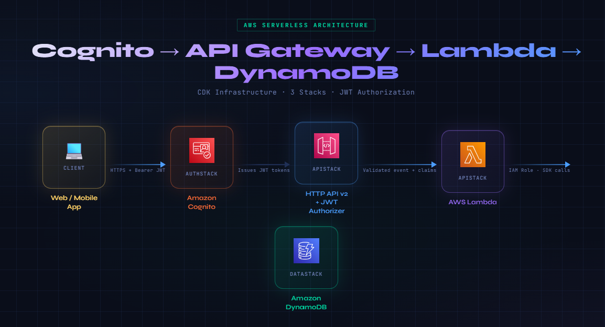

### Components

- **Amazon Cognito** – Authenticates users using secure tokens (JWT).
- **Amazon API Gateway (HTTP API)** – Exposes secure endpoints, protected by Cognito JWT authorizer.
- **AWS Lambda** – Handles note create/read and enforces server-side identity binding using JWT claims (`sub`).
- **Amazon DynamoDB** – Stores user notes with partition/sort keys.
- **AWS CDK (Python)** – Defines and deploys infrastructure as code.

## CDK Stack Structure

The infrastructure is organized into three CDK stacks (`AuthStack`, `DataStack`, `ApiStack`) for modularity and separation of concerns—making changes safer, deployments cleaner, and security reviews easier.

  
<b>CDK Stack Decomposition (AuthStack / DataStack / ApiStack)</b>

  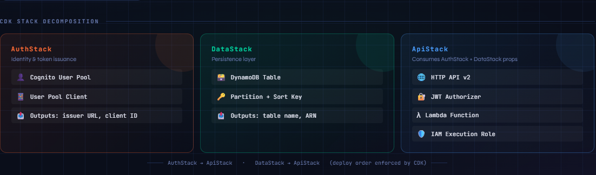

| Stack Name  | Purpose                                                          |
| ----------- | ---------------------------------------------------------------- |
| `AuthStack` | Creates **Cognito User Pool** and **App Client**                 |
| `DataStack` | Provisions a **DynamoDB** table with `userId` + `noteId`         |
| `ApiStack`  | Deploys **Lambda**, **API Gateway**, and integrates **JWT Auth** |

  

--- 

## Security Design
This project adopts a Zero-Trust security model with token-based access control, server-side authorization, and infrastructure as code.

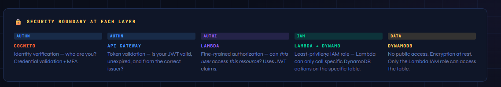

Enforced server-side authorization by binding all DynamoDB reads/writes to the authenticated JWT principal (preferring immutable `sub`), preventing horizontal privilege escalation (BOLA/IDOR). Validated controls end-to-end with Cognito token issuance and negative testing (unauthenticated + spoof attempts).

- **JWT-Based Stateless Authentication (AuthN)** - API Gateway validates Cognito-issued JWTs on every request via HTTP API JWT authorizer.
- **Server-Side Authorization (AuthZ) / Identity Binding** - Lambda derives identity from JWT claims (prefers immutable `sub`) and scopes all DynamoDB reads/writes to that principal, preventing BOLA/IDOR.
- **Least Privilege IAM** - GET and POST routes use separate Lambda functions with route-specific DynamoDB permissions to reduce blast radius.
- **No Hardcoded Credentials** - Authentication uses Cognito; no secrets stored in repo.
- **IaC + Repeatability** - Infrastructure is defined in CDK for consistent deployments and auditability.
- **CORS enforced at API Gateway** (preflight handled at edge; explicit allowed origins + headers).
- **Evidence-backed validation** - Control evidence is organized under [`evidence/`](evidence/) with deployment proof, JWT authorization tests, spoof-prevention validation, logging controls, data protection controls, and least-privilege IAM evidence.

  

---

## Zero Trust Principles Implemented

| Principle | AWS implementation |
|---|---|
| Never trust, always verify | API Gateway validates Cognito-issued JWTs on every protected route |
| Enforce least privilege | Separate Lambda functions and route-specific IAM permissions reduce blast radius |
| Verify explicitly | Lambda derives the user identity from validated JWT claims instead of trusting client-supplied user IDs |
| Assume breach | Structured logging, API access visibility, and X-Ray tracing support investigation and containment |
| Protect data by default | DynamoDB uses customer-managed KMS encryption and point-in-time recovery |
| Build repeatable controls | AWS CDK defines authentication, API, compute, and data controls as infrastructure as code |

---

## Threat Model & Controls Matrix

| Attack vector | Framework mapping | Control implemented | Evidence |
|---|---|---|---|
| Unauthenticated API access | OWASP API2 / NIST AC-3 | Cognito JWT authorizer is attached to protected API routes | [`evidence/pr1/`](evidence/pr1/) |
| Horizontal privilege escalation (BOLA/IDOR) | OWASP API1 | Lambda binds reads and writes to the authenticated JWT `sub` claim | [`evidence/pr1/`](evidence/pr1/) |
| Overprivileged Lambda execution | MITRE T1098 / NIST AC-6 | GET and POST routes use separate Lambda functions with route-specific IAM permissions | [`evidence/pr4/`](evidence/pr4/) |
| Data at rest exposure | NIST SC-28 | DynamoDB uses customer-managed KMS encryption and point-in-time recovery | [`evidence/pr3/`](evidence/pr3/) |
| Missing audit visibility | NIST AU-2 / AU-12 | API access logging, structured Lambda logging, and X-Ray tracing support investigation | [`evidence/pr2/`](evidence/pr2/) |
| Secrets in source code | NIST IA-5 | Authentication uses Cognito and no hardcoded credentials are stored in the repository | Repository review |
| Cross-origin abuse | OWASP API8 | CORS is restricted to approved origins, methods, and headers | [`evidence/pr1/`](evidence/pr1/) |

---

## Evidence Index

| Evidence folder | What it demonstrates |
|---|---|
| [`evidence/pr1/`](evidence/pr1/) | Cognito JWT authorization, unauthenticated access denial, CORS validation, and BOLA/IDOR spoof-prevention testing |
| [`evidence/pr2/`](evidence/pr2/) | API access logging, structured Lambda logging, log retention, and X-Ray tracing |
| [`evidence/pr3/`](evidence/pr3/) | DynamoDB customer-managed KMS encryption, point-in-time recovery, and stage-safe data protection controls |
| [`evidence/pr4/`](evidence/pr4/) | Split GET/POST Lambda functions with route-specific IAM permissions for least privilege |

---

## Screenshots

### CDK Bootstrap (Environment Setup)
Environment bootstrapped to allow CDK deployment using AWS execution roles.

  

### CDK Deployment – Auth Stack
Provisioned Cognito User Pool and App Client for zero-trust JWT authentication.
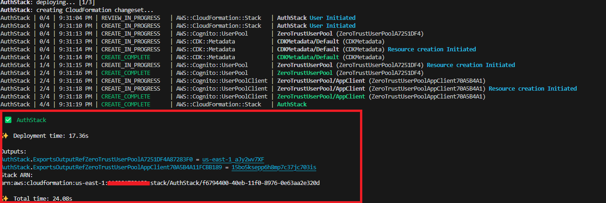

  

### CDK Deployment – Data Stack
DynamoDB table created with userId and noteId as composite keys.
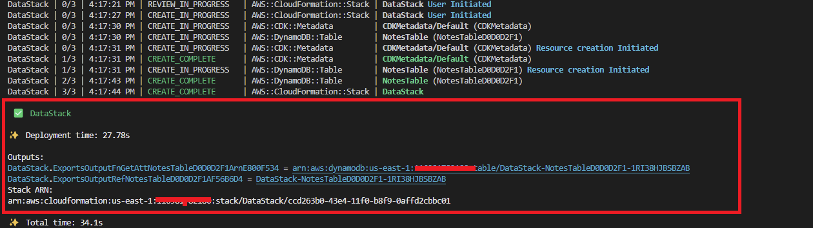

  

### CDK Deployment – API Stack
API Gateway HTTP API set up with Lambda integration secured by Cognito JWT authorizer.
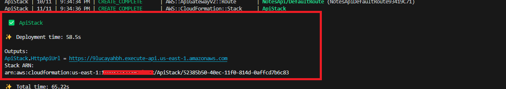

  

### DynamoDB Table Scan (Before Note Created)
Initial scan of the notes table confirms successful deployment.
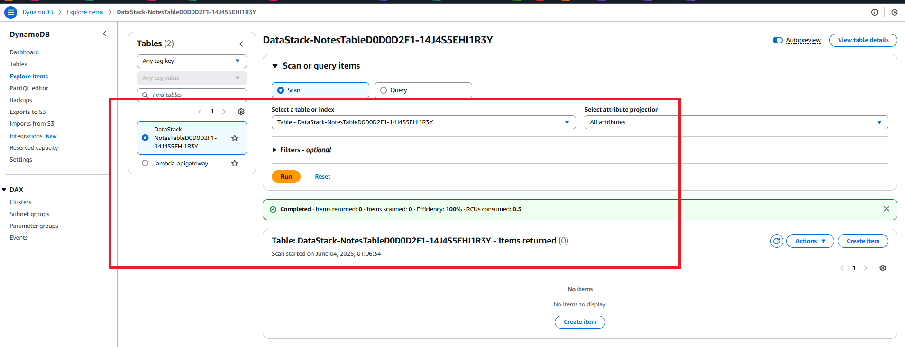

  

### DynamoDB Table Scan (After Note Created)
Scan result confirms a secure note was successfully stored.
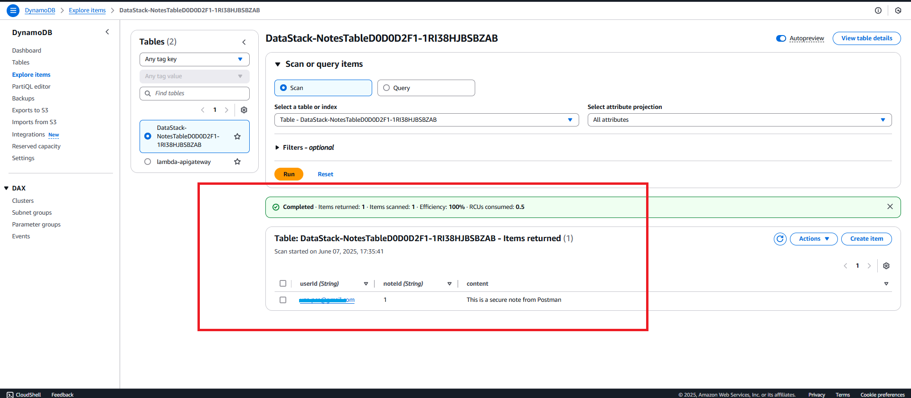

  

### Cognito User View
Verified Cognito user ready to retrieve a JWT and invoke protected APIs.
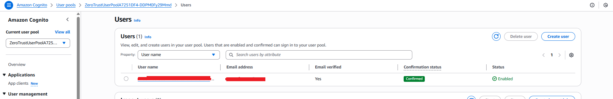

  

### API Gateway Overview
HTTP API deployed with default stage and accessible invoke URL.

  

### JWT Authorizer Configuration
Authorizer enforces strict token validation for all routes.
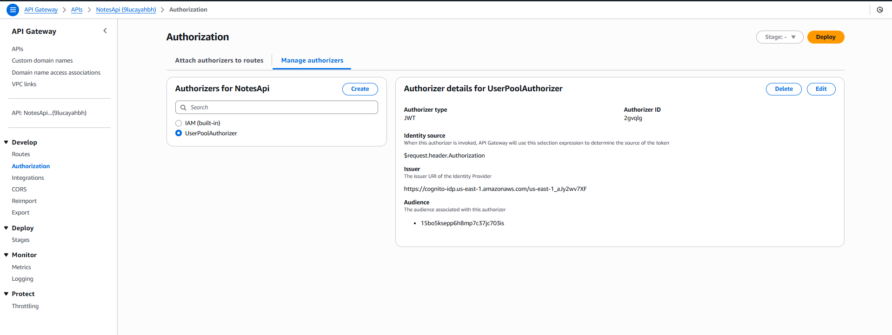

  

### Lambda Integration (Routes → Lambda)
Routes (`GET /notes`, `POST /notes`) integrate with the Lambda handler.

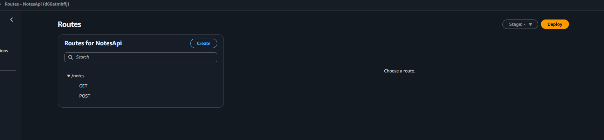
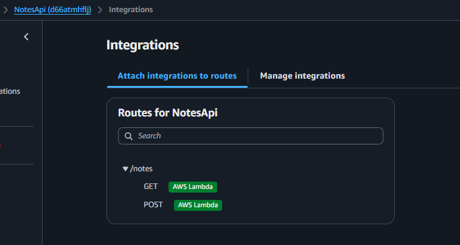

  

### Secure Note Creation via JWT (CLI)
POST request with a valid JWT confirms end-to-end authentication flow.
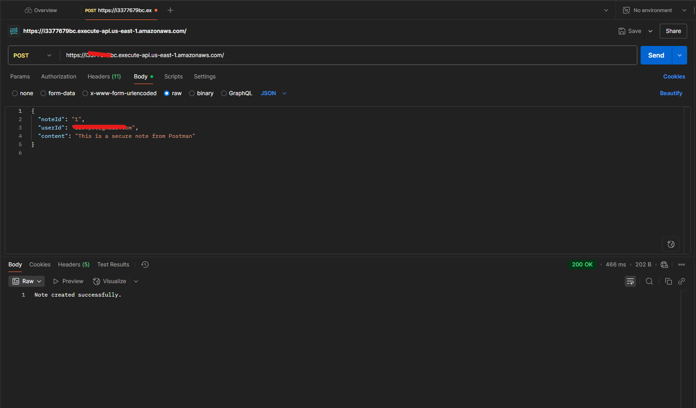

  

### Unauthenticated Request Denied
GET without a JWT is rejected by the authorizer (401/403).
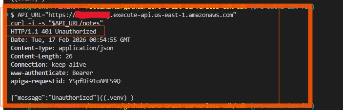

  

### Spoof Attempt Prevented (BOLA/IDOR Mitigation)
POST attempts to spoof `userId` are ignored; stored/query `userId` remains the authenticated JWT principal (`sub`).
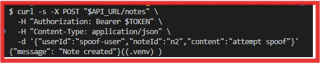
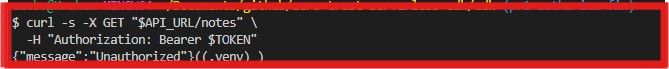

  

## Deployment & Testing
Please see the [Deployment Guide](./deployment-guide.md) for instructions on:

- CDK Deployment Steps
- Cognito User Creation
- CLI & Postman JWT Testing
- Cleanup with `cdk destroy`

  

## Roadmap

- Add automated security tests for JWT authorization, BOLA/IDOR prevention, and route-level IAM behavior
- Add CI workflow for CDK synthesis, unit tests, and security checks
- Add AWS WAF in front of API Gateway for additional request filtering
- Add Security Hub or AWS Config mapping for continuous compliance reporting
- Add multi-environment deployment patterns for dev, staging, and production

  

## Author

**Uzo B.**

## License

This project is licensed under the MIT License.

