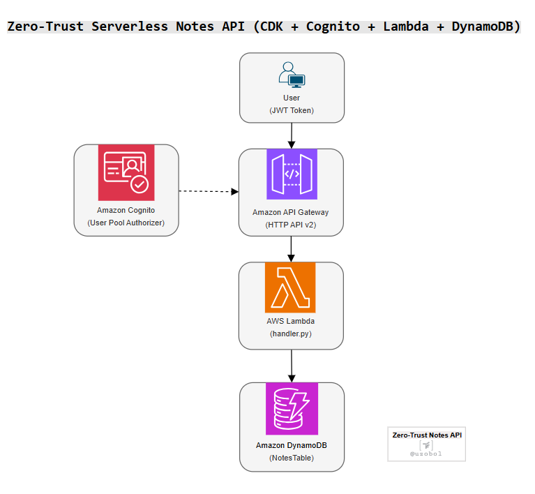

# 🚀 Zero-Trust Serverless Notes API (CDK + Cognito + Lambda + DynamoDB)
A secure, fully serverless Notes API built using AWS CDK (Python), Cognito, Lambda, API Gateway, and DynamoDB. Designed using Zero Trust principles and least-privilege access to showcase modern authentication and infrastructure-as-code (IaC) patterns.

--- 

## 📌 Project Features
- 🔐 **Zero Trust Authentication** using Amazon Cognito and JWT validation
- ☁️ **Serverless** architecture with AWS Lambda and API Gateway (HTTP API v2)
- 🛡 **Fine-Grained IAM**: Lambda has scoped access (PutItem only)
- 💾 **DynamoDB**: Notes stored by composite key (`userId` + `noteId`)
- 🧱 **Modular CDK Stacks**: `AuthStack`, `DataStack`, and `ApiStack
- 🧪 **Tested** via `curl`, PowerShell, and Postman (JWT Auth flows)

---

## 🏗️ Architecture Overview

This project uses a zero-trust, serverless design with token-based authentication, least-privilege access control, and modular infrastructure-as-code deployment.

### Components

- **Amazon Cognito** – Authenticates users using secure tokens (JWT).
- **Amazon API Gateway (HTTP API)** – Exposes secure endpoints, protected by Cognito JWT authorizer.
- **AWS Lambda** – Handles note creation with least-privilege permissions.
- **Amazon DynamoDB** – Stores user notes with partition/sort keys.
- **AWS CDK (Python)** – Defines and deploys infrastructure as code.

## CDK Stack Structure
| Stack Name  | Purpose                                                          |
| ----------- | ---------------------------------------------------------------- |
| `AuthStack` | Creates **Cognito User Pool** and **App Client**                 |
| `DataStack` | Provisions a **DynamoDB** table with `userId` + `noteId`         |
| `ApiStack`  | Deploys **Lambda**, **API Gateway**, and integrates **JWT Auth** |

## 🔐 Security Design
This project adopts a Zero-Trust security model with token-based access control, scoped permissions, and infrastructure as code.

- ✅ **JWT-Based Stateless Authentication** – Cognito User Pools issue signed JWTs used to authenticate API requests.
- ✅ **Least Privilege IAM Permissions** – Lambda function is granted only `PutItem` access to the DynamoDB table.
- ✅ **No Hardcoded Credentials** – All authentication is handled securely via Cognito; no secrets in code.
- ✅ **API Gateway Protected with JWT Authorizer** – Verifies the `Authorization` header on every request.
- ✅ **Deployed with CDK Best Practices** – Secure-by-default infrastructure defined in code for repeatability and auditability.

---

## 📸 Screenshots

### CDK Bootstrap (Environment Setup)
Environment bootstrapped to allow CDK deployment using AWS execution roles.

### CDK Deployment – Auth Stack
Provisioned Cognito User Pool and App Client for zero-trust JWT authentication.

### CDK Deployment – Data Stack
DynamoDB table created with userId and noteId as composite keys.

### CDK Deployment – API Stack
API Gateway HTTP API set up with Lambda integration secured by Cognito JWT authorizer.

### DynamoDB Table Scan (Before Note Created)
Initial scan of the notes table confirms successful deployment.

### DynamoDB Table Scan (After Note Created)
Scan result confirms a secure note was successfully stored.

### Cognito User View
Verified Cognito user ready to retrieve a JWT and invoke protected APIs.

### API Gateway Overview
HTTP API deployed with default stage and accessible invoke URL.

### JWT Authorizer Configuration
Authorizer enforces strict token validation for all routes.

### Lambda Integration with $default Route
The $default route connects directly to a Lambda function for note handling.

### ✅ Secure Note Creation via JWT (CLI)
POST request with a valid JWT confirms end-to-end authentication flow.

## ** License **

## 👤 Author
**Uzo B.**

## 📄 License
This project is licensed under the MIT License.

## 📚 Deployment & Testing
Please see the [Deployment Guide](./deployment-guide.md) for instructions on:

- CDK Deployment Steps
- Cognito User Creation
- CLI & Postman JWT Testing
- Cleanup with `cdk destroy`