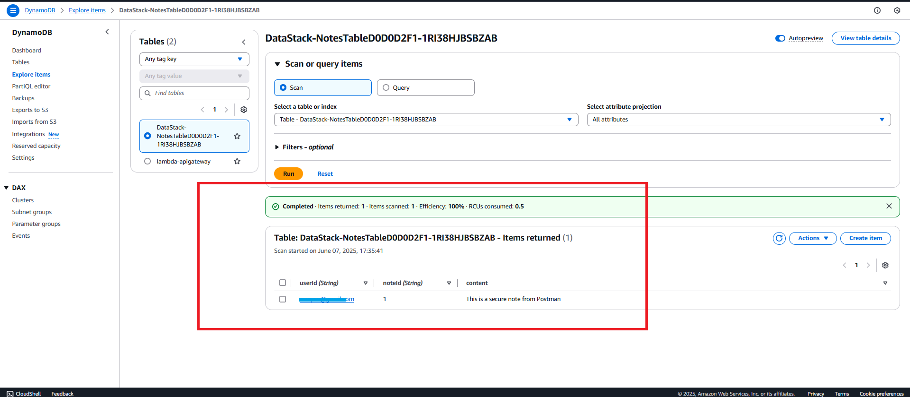

# Deployment Guide: Zero Trust Serverless Notes API

---

## ✅ What Will Be Deployed

- Amazon Cognito User Pool + App Client
- DynamoDB Table (NotesTable)
- AWS Lambda Function (PutNote)
- API Gateway (secured with JWT Authorizer)

<br><br>

---

## 📁 Project Structure
zero-trust-serverless-cdk/


<br><br>

---

##  Getting Started
### Prerequisites
- Python 3.8+
- AWS CLI configured (`aws configure`)
- AWS CDK installed (`npm install -g aws-cdk`)

<br><br>

---

## Deployment Instructions

### Clone + Install CDK
git clone https://github.com/YOUR_USERNAME/secure-notes-api-cdk.git
cd secure-notes-api-cdk


Ensure you are in the Right Directory
Navigate to your CDK project folder where app.py and cdk.json are located:

1. Activate virtual Environment and Install Dependencies
python -m venv .venv
source .venv/bin/activate     # or .\.venv\Scripts\activate on Windows
pip install -r requirements.txt

2. Build Your Environment: Bootstrap CDK (first time only)
cdk bootstrap

3. Deploy the Stack
(Tip: You can deploy stacks individually (e.g., `cdk deploy AuthStack`) if needed.)
cdk deploy --all

(Note: This will deploy all stacks defined in the CDK app
This will deploy:
- Create the Cognito User Pool and App Client (AuthStack)
- Create the DynamoDB notes table (DataStack)
- Lambda + API Gateway secured with JWTs (ApiStack))

4. Once deployment completes, CDK will print outputs.. note them:
Outputs:
  - ApiStack.HttpApiUrl = https://abc123.execute-api.us-east-1.amazonaws.com
    That’s your secured API endpoint.
  - Cognito UserPoolId and AppClientId from AuthStack
Save them — you will need these for Postman or CLI testing.

Example Outputs: 
 - AuthStack.UserPoolId = us-east-1_XXXXXXX
 - AuthStack.UserPoolClientId = abc123xyz...
 - ApiStack.HttpApiUrl = https://abc123.execute-api.us-east-1.amazonaws.com


<br><br>

---

## 🔐 Authentication (Cognito) 

You can use the AWS Console or a script to create users. I will include both.

**Option 1: Script (Optional)**  
- [Bash Script (Linux/macOS)](./create-cognito-user-bash.sh)  
- [PowerShell Script (Windows)](./create-cognito-user-windows.ps1)


**Option 2 : Create Test User (Console)**
1. Create a user via the AWS Console (Cognito > Users > Create User)
    a.Use temporary password and verify email
    b. Check "Mark email as verified"
    c. Require password change (leave ON for now)
    d. Make sure you verify the email and go through the password change step again (so the user is not stuck in FORCE_CHANGE_PASSWORD).


2. 🧑‍💻  Get Cognito Details
From the AWS Console:
Go to Cognito > User Pools > ZeroTrustUserPool
Note down the following details:
       a. User Pool ID (looks like us-east-1_XXXXXX)
       b. App Client ID (go to App Integration > App clients → copy the client ID)

Keep them handy.


## 🧪 Authenticate using the CLI

3. Authenticate using AWS CLI: (Note: If you dont have AWS CLI installed, follow the instructions at https://docs.aws.amazon.com/cli/latest/userguide/getting-started-install.html)

a. Initiate Auth
```
aws cognito-idp initiate-auth \
  --auth-flow USER_PASSWORD_AUTH \
  --client-id <UserPoolClientId> \
  --auth-parameters USERNAME=<email>,PASSWORD=<password>
  ```

b. Respond to Challenge (NEW_PASSWORD_REQUIRED)

```
aws cognito-idp respond-to-auth-challenge \
  --client-id <client-id> \
  --challenge-name NEW_PASSWORD_REQUIRED \
  --challenge-responses USERNAME=<email>,NEW_PASSWORD=<NewSecure456!>,PASSWORD=<Temp1234!> \
  --session <session-string>

```

  (Note: If it works will get this response): 
```
  "AuthenticationResult": {
  "AccessToken": "....",
  "IdToken": "....",
  "RefreshToken": "...."
}
)
```

<br><br>

## 🔁 Test API with JWT

4. Use the returned ID token for API requests.
(Note: The ID token is returned in the response of the previous command)
(curl For Linux/macOS))
 ```
 curl -X POST https://<api-id>.execute-api.<region>.amazonaws.com \
  -H "Authorization: Bearer <IdToken>" \
  -H "Content-Type: application/json" \
  -d '{"noteId": "1", "userId": "user@example.com", "content": "Hello from CLI"}'
```

b. For PowerShell (Windows)
(Note: Replace <AccessToken> with the actual token you received from the authentication step,
and <your-api-endpoint> with your API Gateway endpoint URL)
```
Invoke-RestMethod `
  -Method POST `
  -Uri "https://<api-id>.execute-api.us-east-1.amazonaws.com" `
  -Headers @{
    Authorization = "Bearer <IdToken>"
    "Content-Type" = "application/json"
  } `
  -Body '{"noteId": "1", "userId": "user@example.com", "content": "Hello from PowerShell"}'
```

<br><br>
---


## ✅ Use Postman to Test Your Secured API
Postman Setup for Authenticated Call
1. Open Postman
2. Create a new request
Method: POST 

3. Add Headers
- Go to the Headers tab.
```
  Add:
      Key: Authorization:  Bearer < Your IdToken>
      Value: Bearer <paste-your-IdToken-here>

      Key: Content-Type
      Value: application/json
```

- Add Body (for POST requests)
  Go to the Body tab:
      Select raw
      Select JSON
  Example payload:
```
  {
    "noteId": "1",
    "userId": "your-email-address.com",
    "content": "This is a secure note from Postman"
  }
```

- Hit Send
You should get a 200 OK and a response!


<br><br>

---

## ✅ Verify Note is in DynamoDB Table
-From the AWS Console, navigate to > DynamoDB > Tables > Select your table>  Explore Table Items 
- This will take you to the Explorer view where you can interact with data.
- From the explorer view:
	Ensure Table: DataStack-NotesTable... is selected (which it will be).
	Select Scan mode (default).
	Hit the Run button to execute the scan.

✅ Expected Result
Scan result confirms a secure note was successfully stored.



**Summary**
Status: ✅ Zero Trust API Working!
With a successful response in Postman, you have..

Authenticated with Cognito using JWT
- Called your API Gateway endpoint
- Invoked a Lambda function
- Written a note to DynamoDB


===============================================================================

<br><br>

## ✅  Cleanup
cdk destroy --all
